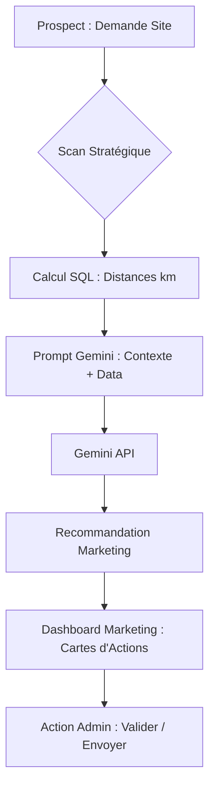

# Architecture de l'Intelligence Artificielle (Klando AI)

Ce document décrit l'implémentation, le flux de données et la stratégie de l'IA au sein de KlandoDash.

## 1. Moteur d'IA : Google Gemini
Klando utilise l'API **Google Gemini** (via le SDK `@google/generative-ai`) pour sa puissance de traitement du langage naturel et sa rapidité.

### Modèles utilisés (Fallback Strategy)
Pour garantir la disponibilité, le système tente d'appeler les modèles dans cet ordre :
1.  **gemini-2.0-flash** (Priorité : Ultra-rapide et moderne)
2.  **gemini-1.5-flash** (Stable et performant)
3.  **gemini-1.5-pro** (Puissant, utilisé en dernier recours)

### Coûts et Pricing
*   **Tier Gratuit** : Actuellement, le projet utilise le "Free Tier" de Google AI Studio (jusqu'à 15 RPM).
*   **Production** : Le modèle "Flash" est extrêmement peu coûteux (environ 0.10$ par million de tokens), ce qui rend le "Scan Stratégique" très rentable.

---

## 2. Qui utilise l'IA ?
L'IA n'est pas accessible aux utilisateurs finaux (clients/chauffeurs) directement pour éviter les coûts incontrôlés. Elle est réservée aux **utilisateurs internes** :

*   **Rôle Admin** : Accès total pour la validation et la supervision.
*   **Rôle Marketing** : Utilise l'IA pour transformer les "Prospects" (Demandes Site) en "Trajets Validés".

---

## 3. Le "Scan Stratégique" (Bouton Marketing)
Le bouton **Scan Stratégique** est le déclencheur manuel de l'intelligence. Voici ce qu'il fait réellement :

1.  **Extraction des données (DB)** : Il récupère toutes les nouvelles demandes clients (Prospects) et les trajets disponibles.
2.  **Analyse de Proximité (SQL)** : Il utilise des fonctions SQL PostGIS pour calculer les distances réelles entre les points de départ/arrivée.
3.  **Génération de Recommandations (IA)** :
    *   Pour chaque prospect, il envoie à Gemini : la route demandée + les 5 meilleurs trajets trouvés par le SQL.
    *   Gemini génère un message marketing personnalisé (WhatsApp ready).
4.  **Stockage** : Les résultats sont stockés dans `dash_ai_recommendations` pour affichage sous forme de cartes d'actions.

**OUI**, le Scan Stratégique utilise massivement l'IA pour chaque prospect analysé.

---

## 4. Flux de Données (Data Flow)

---

## 5. Structure des Prompts (lib/prompts.ts)
Nous utilisons une approche de **Prompt Engineering** stricte pour garantir des réponses structurées :
*   **System Context** : Définit la personnalité (Assistant Klando) et les contraintes (Français, emojis, format court).
*   **Data Context** : Injection de JSON pur pour que l'IA ne "hallucine" pas sur les trajets.
*   **Trigger Tag** : Utilisation du tag `[TRIP_ID]` dans la réponse pour permettre au Dashboard d'extraire automatiquement l'ID du trajet recommandé.

---

## 6. Sécurité et Limites
*   **Isolation** : L'IA n'a jamais accès aux clés privées ou aux mots de passe des utilisateurs.
*   **Vérification Humaine** : L'architecture impose toujours une validation humaine (bouton Valider) avant toute action réelle (envoi de message).
