# Diagrammes d'Architecture KlandoDash

Ce document regroupe les diagrammes Mermaid générés automatiquement représentant la structure actuelle du projet (au 6 février 2026).

## 1. Architecture Technique Globale

Vue d'ensemble de la stack Next.js 14 et de ses interactions avec les services externes.

```mermaid
graph TD
    subgraph Client ["Navigateur Client"]
        UI[Interface React/Shadcn]
        Map[Leaflet Map]
    end

    subgraph Server ["Next.js Server (App Router)"]
        Auth[NextAuth v5]
        API[API Routes / Server Actions]
        Middleware[Middleware (RBAC)]
    end

    subgraph Database ["Supabase (BaaS)"]
        Postgres[(PostgreSQL)]
        Realtime[Realtime (Non utilisé pour le moment)]
    end

    subgraph External ["Services Externes"]
        Google[Google OAuth]
        Resend[Resend (Emails)]
        Intech[Intech (Paiements)]
    end

    UI -->|Server Actions / Fetch| API
    UI -->|Login| Auth
    API -->|Query / Mutate| Postgres
    Auth -->|Vérif Profil| Postgres
    Auth -->|OAuth Flow| Google
    API -->|Envoi Notif| Resend
    Intech -.->|Sync (Legacy/Webhook)| Postgres

    style Server fill:#e1f5fe,stroke:#01579b
    style Database fill:#e8f5e9,stroke:#2e7d32
    style External fill:#fff3e0,stroke:#ef6c00
```

## 2. Schéma de Base de Données (ERD)

Représentation des relations clés. Notez que la table `transactions` est souvent jointe manuellement.


## 3. Flux d'Authentification & Rôles

Comment un admin se connecte et comment ses droits sont vérifiés.

```mermaid
sequenceDiagram
    actor Admin
    participant NextAuth
    participant Google
    participant DB as Supabase (dash_authorized_users)
    participant Middleware

    Admin->>NextAuth: Clic "Se connecter avec Google"
    NextAuth->>Google: Authentification OAuth
    Google-->>NextAuth: Token + Profil (Email, Avatar)
    
    NextAuth->>DB: SELECT * FROM dash_authorized_users WHERE email = GoogleEmail
    
    alt Utilisateur Non Autorisé
        DB-->>NextAuth: null ou active=false
        NextAuth-->>Admin: Accès Refusé
    else Utilisateur Autorisé
        DB-->>NextAuth: {role: 'admin', active: true}
        NextAuth->>DB: UPDATE display_name & avatar_url
        NextAuth-->>Admin: Session Créée (avec Rôle)
    end

    Note over Admin, Middleware: Navigation ultérieure
    
    Admin->>Middleware: Accès /admin/users
    Middleware->>Middleware: Vérifie Session.role == 'admin'
    Middleware-->>Admin: Autorise l'accès
    
    Admin->>Middleware: Accès /stats
    Middleware->>Middleware: Vérifie Session.role == 'admin' (Support refusé)
    Middleware-->>Admin: Autorise ou Redirige
```



## 4. Logique Financière (Cash Flow)

La logique inversée d'Intech expliquée visuellement.

```mermaid
flowchart LR
    subgraph Intech_Logic ["Logique Intech (Fournisseur)"]
        direction TB
        T1[Transaction]
        Code{code_service?}
    end

    subgraph Klando_Interpretation ["Interprétation KlandoDash"]
        C_IN[CASH_IN]
        C_OUT[CASH_OUT]
    end

    subgraph Reality ["Réalité Financière"]
        Sortie[💸 SORTIE d'argent]
        Entree[💰 ENTRÉE d'argent]
    end

    T1 --> Code
    Code -- Contient 'CASH_IN' --> C_IN
    Code -- Contient 'CASH_OUT' --> C_OUT

    C_IN -->|Inversé| Sortie
    C_OUT -->|Inversé| Entree

    Sortie --- Ex1[Paiement Conducteur]
    Sortie --- Ex2[Remboursement]
    
    Entree --- Ex3[Paiement Client Mobile Money]

    style C_IN fill:#ffcdd2,stroke:#c62828
    style C_OUT fill:#c8e6c9,stroke:#2e7d32
    style Sortie fill:#ffebee,stroke:#c62828,stroke-width:2px
    style Entree fill:#e8f5e9,stroke:#2e7d32,stroke-width:2px
```



## 5. Structure des Dossiers (Frontend)

Organisation du code source Next.js.

```mermaid
graph LR
    src[frontend/src]
    
    subgraph App_Router [app/]
        Pages[Pages Principales]
        API[API Routes]
    end
    
    subgraph Lib [lib/]
        Queries[queries/ <br/>(SQL logic)]
        Auth[auth.ts]
        Supabase[supabase.ts]
    end
    
    subgraph Components [components/]
        UI[ui/ <br/>(Shadcn)]
        Modules[Modules <br/>(trips, users, etc.)]
    end

    src --> App_Router
    src --> Lib
    src --> Components
    
    App_Router -->|Fetch Data| Queries
    App_Router -->|Auth Check| Auth
    Queries -->|Call| Supabase
    
    Pages -->|Import| Modules
    Modules -->|Use| UI
```
